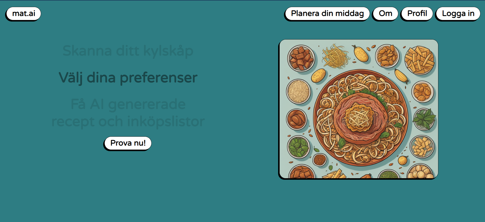

# Frontend for the website "Smartmatplanerare"

## A website where you can plan your weeks meals with a few easy clicks, using AI to build your recipes
### Save, share and reuse recipes written by AI (trained as the perfect chef!)



## Project setup
```
npm install
```

### Compiles and hot-reloads for development
```
npm run serve
```

### Compiles and minifies for production
```
npm run build
```

### Lints and fixes files
```
npm run lint
```

### Customize configuration
See [Configuration Reference](https://cli.vuejs.org/config/).
